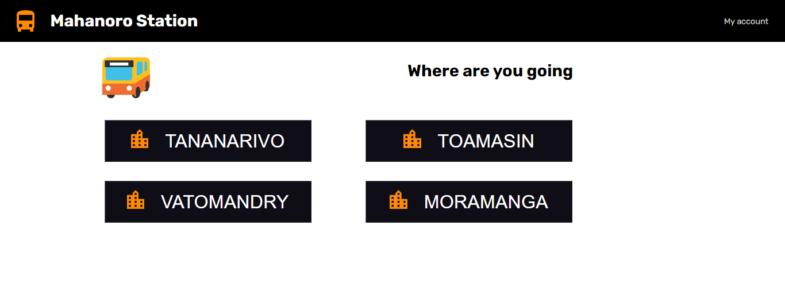

# Report for my project

## How to use this application

   - I was planing to create a bus stion which located in Mahanoro and the first page meant to be all of the place which is avalable to go.
   - Each black button which containe the name of the place is set as a link which allows the user to see more information about the trip where they want to go according the place they have chosen in the first page. This page is the second page of the web.
   - The seconde page containe many inforrmatio but the most interesting one is the pinc button which linked to the booking place for travelling, this button will allow the user to see the booking which hold on some information of the trip like time, date, and the place avalable place once the user booked their place.
   - There is an account link on the top of the page which is clicable to let the user to go in their account and see what reservation they have made which does not really work in here but it meant to be like that.

##  The screen shoot of the project

### First page

## Note

- This application does not really functioning because I couldn't manage to do it but the ideas is what I discribe above. Nothign is functionning The only thing I could do is the link of each page.
